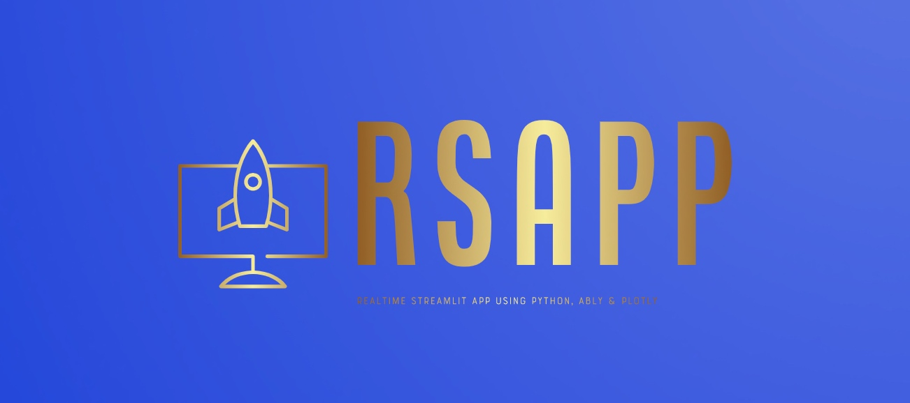

# Building a real-time streamlit app by consuming events from Ably channels using Python, Ably, Plotly (RSAPP)



## About this package

This new solution will consume the real-time events from an emulator & then consume them via Ably channels. Finally, a consumer application will subscribe the channel & read the events & display them in a smart streamlit app embedded with the plotly graphs dynamically. This project is for the advanced Python developer and data Science Newbie.


## How to use this package

(The following instructions apply to Posix/bash. Windows users should check
[here](https://docs.python.org/3/library/venv.html).)

First, clone this repository and open a terminal inside the root folder.


Install the requirements:

```bash
pip install -r requirements.txt
```

Install the above requirements.

Create and activate a new virtual environment (recommended) for consumer application by running
the following:

```bash
python3 -m venv senv
source senv/bin/activate
```

Run the server, which will interact with Ably Channels server by controlling the events.

```bash
python playIOTDevice.py
```

Create and activate a new virtual environment (recommended) for consumer application by running
the following:

```bash
python3 -m venv env
source env/bin/activate
```

Let's run the main streamlit application, which will provide the Open AI response from the source data by querying based on simple text & get the SQL response based on that -

```bash
streamlit run app.py
```

Please find the some of the important dependent package -

```

pip install ably==2.0.3
pip install numpy==1.26.3
pip install pandas==2.2.0
pip install plotly==5.19.0
pip install requests==2.31.0
pip install streamlit==1.30.0
pip install streamlit-autorefresh==1.0.1
pip install streamlit-echarts==0.4.0


```

## Screenshots


## Resources

- To view the complete demo with sound, check out our [YouTube Page](https://youtu.be/-nr6HX1rYf4).
- To view on Python, check out the [Python Page](https://docs.python.org/3/).
- To view more on the Ably, check out this [OpenAI Official Page](https://ably.com/docs/getting-started/quickstart?lang=python).
- To view more on the Plotly, check out this [SQLAlchemy Official Page](https://plotly.com/python-api-reference/).
- To view more on the Streamlit, check out this [Flask Official Page](https://docs.streamlit.io/).
